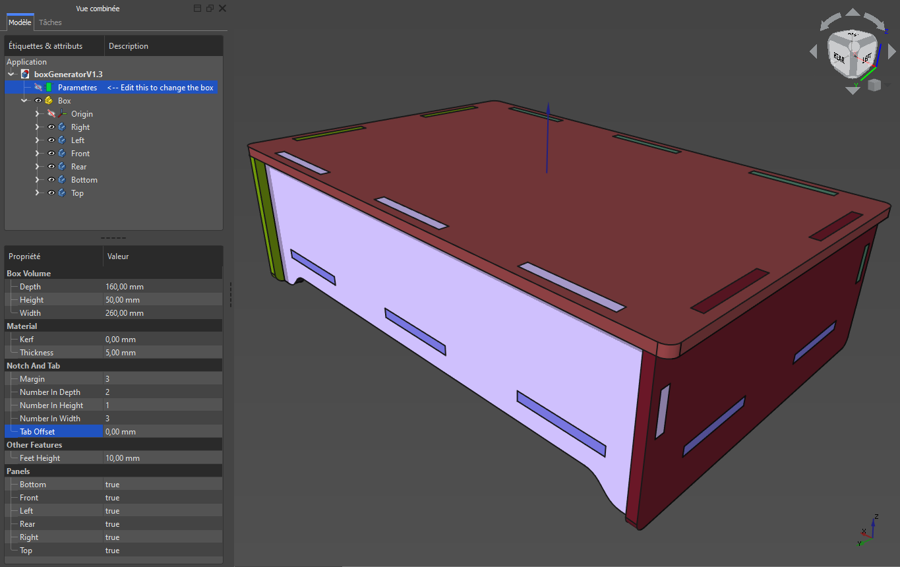
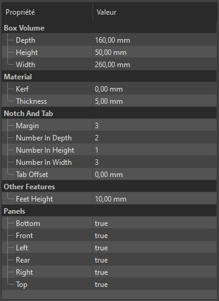
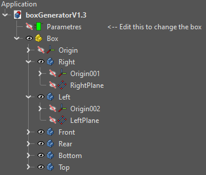
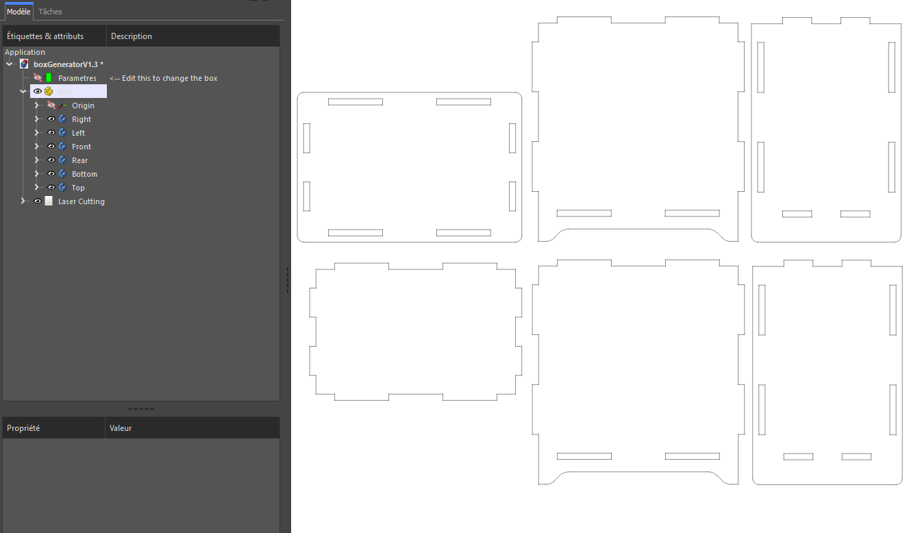
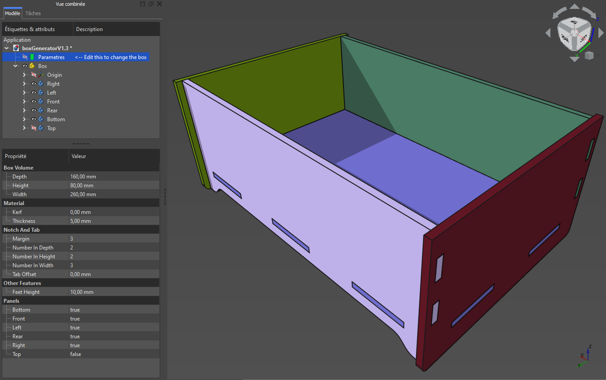
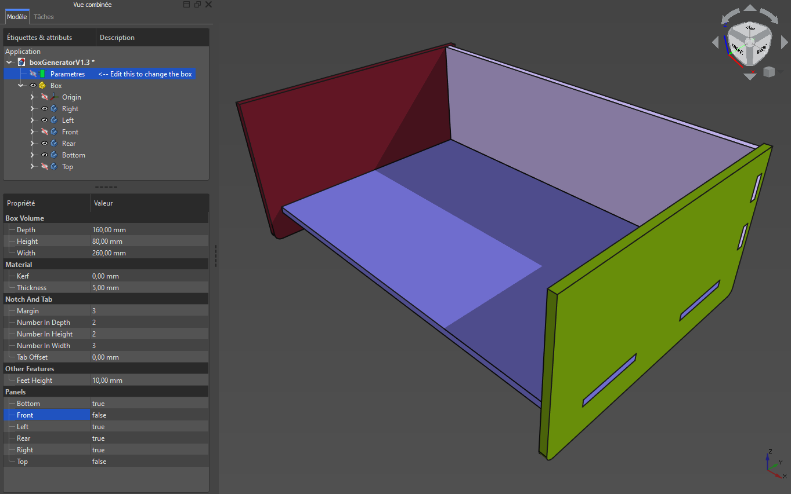
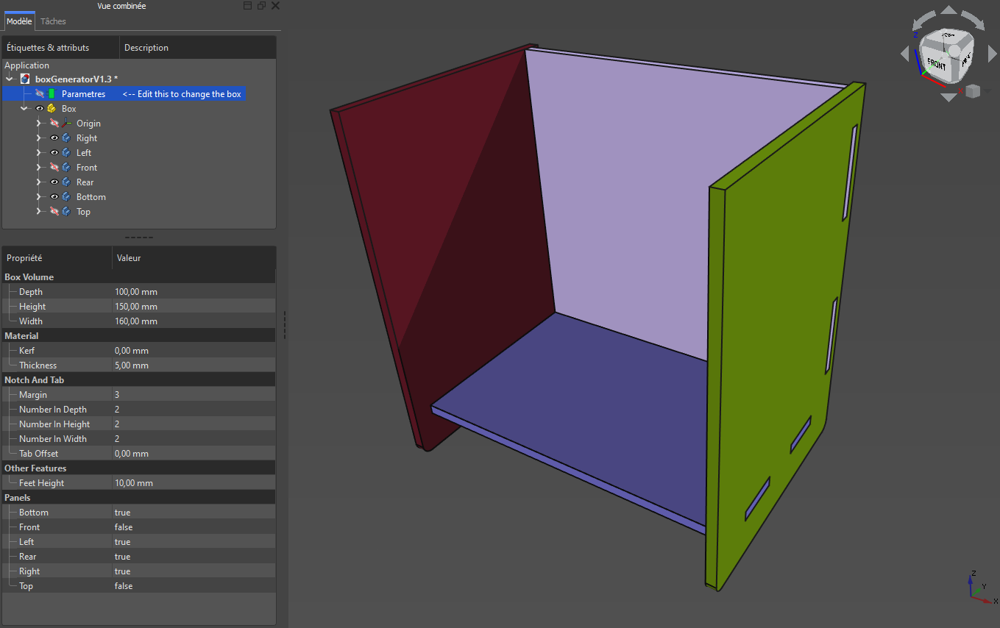

# Box Generator - Un générateur de boites pour la découpe laser

Projet de génération de boites paramétriques pour la découpe laser sous [FreeCAD 0.19 (RealThunder)](https://github.com/realthunder/FreeCAD_assembly3/releases).

**ATTENTION** : Le projet étant réalisé avec la version [FreeCAD 0.19 de RealThunder](https://github.com/realthunder/FreeCAD_assembly3/releases), il est possible que ce projet ne fonctionne pas sous une autre version de FreeCAD.

**NOTE POUR LES VERSIONS LINUX ET MACOS** : en raison de différences entres les différentes version de la 0.19 RT uniquement sur les OS, pour linux & mac, faire clic droit sur le doc dans l'arborescence et cliquer sur "marquer pour recalculer" et effectuer le recalcul avant de faire des modifs de parametre. Une issue a été postée sur la version de RT pour comprendre l'origine du soucis : https://github.com/realthunder/FreeCAD_assembly3/issues/500

Vous pouvez parametrer votre boite à l'aide de l'outil "Parameters" dans l'arbre de conception à gauche. Le fichier permet al génération de boite de divers dimmensions et dont les faces peuvent également être retirées en cas de besoins. Le nombre de tab et d'encoches sont paramètrable dans les trois directions et il est également possible de placer un offset de longueur sur les tab pour, par exemple, effectuer un poncage ulterieur.

Chaque panneau dispose d'un plan de construction pour divers modifications personnalisées. Les fonctions de generation sont "cachées".

Les plans de découpe sont automatiquement générés et prêts à être exportés en svg pour la découpe laser.

