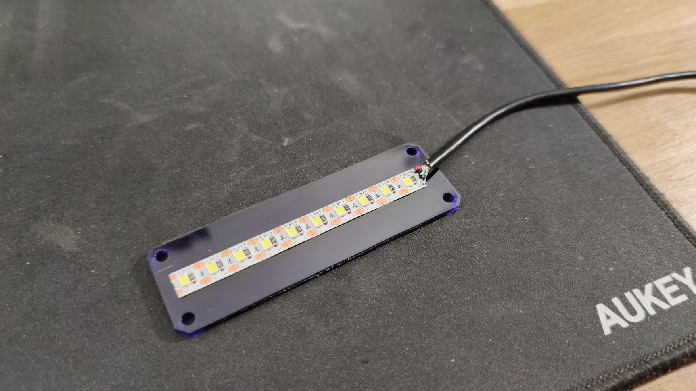
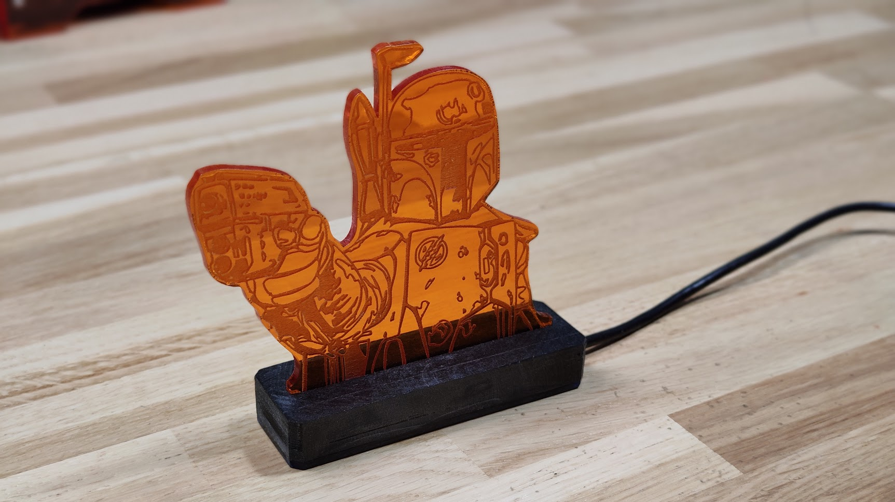

# Boba Fett - stand lumineux en acrylique

Stand lumineux en acrylique simple. Réalisé sur FreeCAD. Assemblage d'une boitier en impression 3D et d'un couvercle en acrylique (peut être imprimé également). Strip de led collé et alimenté en 5V via USB.

## Logiciels utilisés :

FreeCAD 0.19 de Real thunder : https://github.com/realthunder/FreeCAD_assembly3/releases/tag/0.11

Inkscape 1.0.1 : https://inkscape.org/release/inkscape-1.0.1/

K40 Whisperer : https://www.scorchworks.com/K40whisperer/k40whisperer.html

Cura : https://ultimaker.com/fr/software/ultimaker-cura
